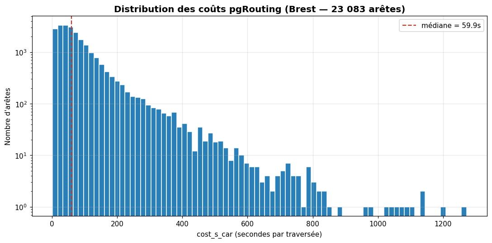

# pgRouting et r2gg : du tronçon au plus court chemin

> **À lire avant la Phase 2.** Cette page explique *pourquoi* on a besoin d'un graphe et *comment* r2gg le construit.

---

## Le problème : un tronçon BDTOPO n'est pas un graphe

La BDTOPO stocke chaque route comme une **`LINESTRING`** avec des attributs (nature, vitesse, largeur…). Mais **rien n'y ressemble à un graphe** :

- Pas de nœuds explicites (intersections)
- Pas d'arêtes orientées avec un coût
- Pas de notion de "voisin"

Avec ce modèle, "trouver le plus court chemin entre A et B" devient :

```sql
WITH RECURSIVE chemin AS (
  -- cas de base : tronçons partant de A
  SELECT … FROM troncon_de_route WHERE …
  UNION ALL
  -- cas récursif : tronçons connectés au précédent
  SELECT … FROM chemin c JOIN troncon_de_route t ON ST_Touches(c.geom, t.geom)
  -- profondeur 5+ → plan d'exécution explose, pas d'élagage Dijkstra
)
SELECT * FROM chemin;
```

**Verdict** : possible en théorie, **impraticable** en pratique — pas de pondération, pas d'élagage, pas de Dijkstra.

---

## La solution : pivoter en graphe (r2gg)

**r2gg** (route-graph-generator) transforme la table linéaire en un schéma **nœuds + arêtes** :

```{mermaid}
%%{init: {'theme': 'neutral', 'themeVariables': {'clusterBkg': '#f0f4ff', 'clusterBorder': '#8899cc', 'primaryBackgroundColor': '#ffffff', 'primaryTextColor': '#1a1a1a', 'lineColor': '#333366'}}}%%
flowchart LR
  subgraph BDTOPO["BDTOPO (PostGIS)"]
    T["troncon_de_route<br/>├─ geometrie (line)<br/>├─ nature<br/>├─ vitesse_moyenne<br/>├─ largeur_de_chaussee<br/>└─ restriction_*"]
  end
  subgraph PIVOT["Pivot (graphe)"]
    V["ways_vertices_pgr<br/>├─ id, the_geom (point)"]
    W["ways<br/>├─ source, target → vertex<br/>├─ cost, reverse_cost<br/>└─ length_m, attributs"]
  end
  BDTOPO -->|r2gg| PIVOT
```

Deux étapes invisibles mais cruciales :

1. **Découpage aux intersections** : un tronçon BDTOPO qui en croise un autre est *coupé* en plusieurs arêtes au point d'intersection. C'est pour ça que `count(*) FROM ways` est très différent de `count(*) FROM troncon_de_route`.
2. **Création des nœuds** (`ways_vertices_pgr`) à chaque extrémité d'arête.

> 🧠 **Le déclic** : sans découpage aux intersections, un véhicule "passerait à travers" un croisement sans pouvoir tourner. Le graphe a besoin de **nœuds aux intersections** pour modéliser les choix de l'algorithme.

---

## `cost` et `reverse_cost` — pourquoi deux colonnes ?

Une arête routière peut avoir des coûts **asymétriques** :

| `cost` (source → target) | `reverse_cost` (target → source) | Sens |
|--------------------------|----------------------------------|------|
| 100 | 100 | route à double sens |
| 100 | -1 | sens unique (interdit dans l'autre sens) |
| -1 | -1 | arête bloquée (destruction simulée Phase 3) |

> ⚠️ Convention pgRouting : **`-1` = interdit** (pas zéro, pas `NULL`).

#### Distribution réelle des coûts (Brest)



**Histogramme log** des `cost_s_car` (temps de traversée en secondes par arête) du dump Brest. La majorité des arêtes coûtent quelques secondes — c'est ce que Dijkstra additionne le long du chemin. La queue à droite (axe log) correspond aux tronçons très longs ou lents (chemins forestiers, restrictions). Cette distribution gouverne directement la rapidité de l'algorithme : peu de très gros coûts = expansion régulière, queue épaisse = exploration plus chère.

::: {.callout-tip title="🎯 Une seule arête, deux directions possibles"}
Chaque tronçon a **une géométrie** mais peut être parcouru dans les **deux sens**. `cost` est le prix du sens *source → target*, `reverse_cost` le prix du sens inverse. La convention `-1` est un drapeau : pgRouting le détecte comme "interdiction" et n'essaiera pas cette direction.
:::

```{mermaid}
%%{init: {'theme': 'neutral', 'themeVariables': {'clusterBkg': '#f0f4ff', 'clusterBorder': '#8899cc', 'primaryTextColor': '#1a1a1a', 'lineColor': '#333366'}}}%%
flowchart LR
  subgraph BIDI["🛣️ Route bidirectionnelle"]
    A1((source)) -- "cost = 100" --> B1((target))
    B1 -- "reverse_cost = 100" --> A1
  end
  subgraph UNI["⬆️ Sens unique"]
    A2((source)) -- "cost = 100" --> B2((target))
    B2 -. "reverse_cost = -1<br/>(interdit)" .-> A2
  end
  subgraph BLOCK["⛔ Arête détruite (Phase 3)"]
    A3((source)) -. "cost = -1" .-> B3((target))
    B3 -. "reverse_cost = -1" .-> A3
  end
```

Le coût peut être :

- la **longueur** (plus court chemin géométrique)
- le **temps** (longueur / vitesse)
- une **fonction métier** (poids véhicule, restrictions, discrétion…)

**Formule de coût temporel** :
```sql
cost = ST_Length(geom) / NULLIF(vitesse_moyenne_vl, 0) / 1000.0
-- resultat = temps en heures
-- NULLIF(vitesse, 0) retourne NULL si vitesse = 0 (piéton)
-- pgRouting ignore les tronçons avec cost = NULL
```

> Si `vitesse_moyenne_vl = 0` (chemin piéton), `NULLIF` retourne `NULL` → pgRouting ignore ce tronçon pour le routage motorisé.

::: {.callout-tip title="🎯 Pourquoi `NULLIF` plutôt que de laisser 0 ?"}
Le coût temporel est `longueur / vitesse`. Si la vitesse vaut `0`, on tombe sur une **division par zéro** → temps **infini** (ou erreur SQL).

`NULLIF(vitesse, 0)` dit : *"si la vitesse est nulle, remplace-la par `NULL`"*. Le calcul devient `longueur / NULL = NULL`, et pgRouting traite `cost = NULL` comme **"arête à ignorer"** — exactement ce qu'on veut pour un chemin piéton que la voiture ne peut pas emprunter.

Mettre `cost = 0` serait pire : pgRouting prendrait ce tronçon **gratuitement** et trouverait des itinéraires absurdes passant par des sentiers de chèvres.
:::

> **BDTOPO en chiffres** : ~28% des arêtes du graphe BDTOPO ont `cost = -1` ou `reverse_cost = -1` — essentiellement les **sens uniques** et les restrictions de circulation. Ce n'est pas une anomalie, c'est la réalité du réseau routier. `pgr_dijkstra` ignore silencieusement ces arêtes. En Phase 3, vous pourrez simuler des destructions en mettant `cost = -1` sur un pont ou un nœud, forçant le routage à contourner.

---

## Dijkstra sous pgRouting

```sql
SELECT seq, node, edge, cost, agg_cost
FROM pgr_dijkstra(
  'SELECT id, source, target, cost, reverse_cost FROM ways',
  source_vertex,    -- id du nœud départ
  target_vertex,    -- id du nœud arrivée
  directed := false
);
```

Trois éléments :

1. **La requête sur `ways`** est passée en **string** — pgRouting la lit pour construire le graphe en mémoire.
2. **`directed`** : si `true`, `cost` et `reverse_cost` sont distincts ; si `false`, on prend le plus petit des deux.
3. Le résultat est une suite ordonnée d'arêtes (pas la géométrie). Pour la carte, il faut joindre avec `ways` sur `edge = ways.id`.

> **Performance** : `pgr_dijkstra` relit et reconstruit le graphe en mémoire **à chaque appel**. Pour des requêtes répétées (boucle sur 50 POIs), utilisez `pgr_dijkstraCostMatrix` qui ne construit le graphe qu'une seule fois.

### Matrice de distances : `pgr_dijkstraCostMatrix`

Quand vous avez N points de départ et M destinations, une matrice est plus efficace qu'N × M appels à `pgr_dijkstra` :

```sql
-- Construire la matrice de coûts entre 3 nœuds (ici : 3 sommets d'aérodromes)
SELECT * FROM pgr_dijkstraCostMatrix(
  'SELECT gid AS id, source, target, cost FROM ways',
  ARRAY[101, 204, 387]  -- IDs des nœuds départ/arrivée
);
-- Retourne : une ligne par couple (source, target) + coût agrégé
```

Résultat :
```
 source | target | agg_cost
--------+--------+----------
    101 |    204 |   15420.3
    101 |    387 |   28930.7
    204 |    101 |   15420.3
    ...
```

> Utile pour Phase 2 T10 : calculer la matrice de distances entre 10 EPCIs sans relancer Dijkstra 100 fois.

---

## Comment "snapper" un POI au graphe

Un POI est un point quelconque, pas un nœud du graphe. On lui associe le **sommet le plus proche** :

```sql
SELECT
  p.cleabs,
  (SELECT id FROM ways_vertices_pgr v
   ORDER BY v.the_geom <-> p.geom
   LIMIT 1) AS vertex_id,
  ST_Distance(p.geom, v.the_geom) AS dist_snap
FROM mission_pois p;
```

> Le `<->` (KNN) utilise l'index GIST → rapide. `LIMIT 1` est essentiel.

**Si un POI a une `dist_snap` très grande**, c'est qu'il est **loin de toute route** (par exemple, en pleine forêt). Vérifier que le routage depuis ce POI a un sens.

---

## Algorithmes pgRouting utiles

| Fonction | Cas d'usage Phase 2/3 |
|----------|----------------------|
| `pgr_dijkstra` | Plus court chemin point-à-point |
| `pgr_dijkstraCostMatrix` | **Matrice** de distances entre N sources et M cibles (Phase 2 T10) |
| `pgr_drivingDistance` | **Isochrone** : tous les nœuds atteignables sous un coût max (Phase 2 T11) |
| `pgr_connectedComponents` | **Composantes connexes** : groupes de nœuds connectés entre eux (Phase 3 T9). Réponse à : "si on coupe ce pont, y a-t-il des nœuds isolés ?" |
| `pgr_aStar` | Variante avec heuristique géographique (plus rapide pour les longues distances) |

### `pgr_connectedComponents` en détail

```sql
SELECT * FROM pgr_connectedComponents(
    'SELECT id, source, target, cost, reverse_cost FROM ways'
);
-- Retourne : component (id du groupe), node_id (sommet)
-- Tous les nœuds avec le même component sont connectés entre eux.
-- Compter les groupes : SELECT component, count(*) FROM ... GROUP BY 1
```

---

## Pourquoi pas Cypher pour le routage routier ?

On *pourrait* migrer le graphe routier dans Neo4j, mais :

| Critère | pgRouting | Neo4j |
|---------|-----------|-------|
| Construction du graphe | Auto via r2gg + PostGIS | À faire à la main (gros pipeline) |
| Spatial joint au routage | Natif (`ST_DWithin`) | Pas natif |
| Algorithmes Dijkstra/A* | Optimisés sur 20M arêtes | OK mais moins matures à cette taille |
| Routage **contraint** dynamique | `cost` calculé en SQL | Plus délicat |

→ **Conclusion** : pour le routage routier, on reste en pgRouting. Neo4j entre en jeu pour l'**ontologie** et le **réseau de POIs** (où Cypher excelle).

---

## Pour aller plus loin

- [PostGIS — essentiels](postgis.qmd) — pré-requis spatial
- [APOC](../avance/apoc.qmd) — algorithmes côté Neo4j (betweenness, sub-graphes)
- [Phase 2](../../mission/phase_2.qmd) — la pratique
